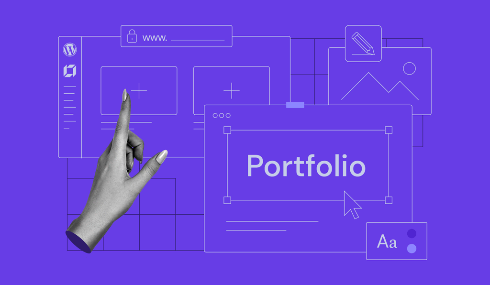

# Portfolio Template 2

## Project Description

**Portfolio Template 2** is a user-friendly portfolio showcase featuring smooth animations and a fully responsive design for all screen sizes. This project was developed as a practice exercise in **Front-End Development**.

## Technologies Used

-   **HTML** (including semantic elements)
-   **CSS**
-   **JavaScript**
-   **Font Awesome**

## Features

-   Easy-to-use portfolio template
-   Smooth animations for a modern feel
-   Fully responsive design
-   Clean and structured HTML with semantic elements

## Project Structure

-   `index.html` - Main page of the website
-   `css/` - Contains all styling files:
    -   `normalize.css` - Resets default browser styles
    -   `style.css` - Main stylesheet for the project
-   `JS/` - Contains JavaScript files:
    -   `main.js` - Handles interactive elements and animations
-   `images/` - Contains all image assets

## Project Links

-   [Live Website](https://mohamedayman011.github.io/portfolio-template-2/)
-   [Design Reference](https://elzerowebschool.github.io/HTML_And_CSS_Template_Three/)
